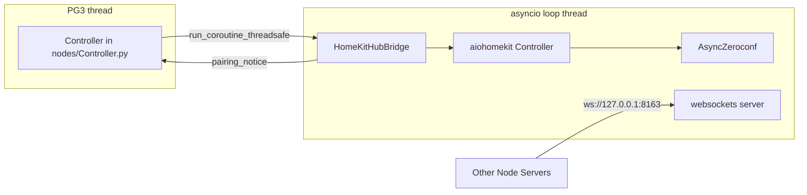
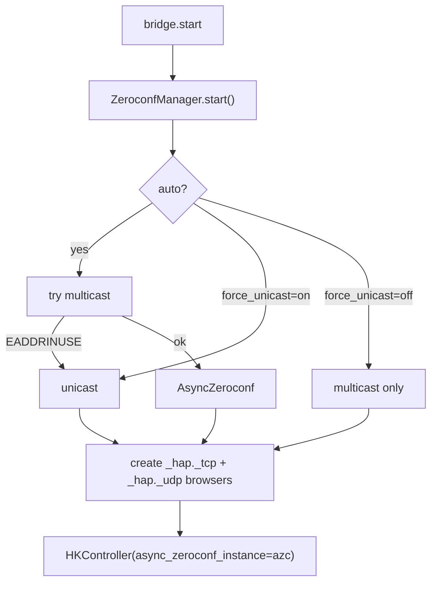
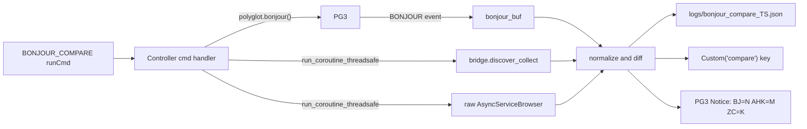

# Improvements review

## Continuation status (2026-04-29)

- **P6 (Bonjour):** Live `BONJOUR_COMPARE` JSON shows PG3 can return rich HAP rows when `poly.bonjour` uses broad filters (e.g. `type=None`). Overlap with aiohomekit/raw zeroconf was confirmed for at least one accessory (ecobee). **Full replacement of `AsyncZeroconf` for stock aiohomekit remains out of scope.** Tradeoffs are documented for operators in [`CONFIG.md`](../../CONFIG.md) (section *PG3 Bonjour vs in-process zeroconf*). Diagnostic/compare tooling may live on branch `old-pg-mdns` while **main** stays zeroconf-focused.
- **P0 on `main`:** **pytest**, **CHANGELOG**, **GitHub Actions CI** (`.github/workflows/ci.yml`), and core helper tests are in-repo. Profile/version tracks releases (e.g. **0.1.11** refines the longPoll asyncio-loop watchdog: **GV0**/**ERR** only, not **ST**).
- **P1 just landed:** **longPoll** checks whether the asyncio loop thread is still alive while `ready`; on unexpected exit sets **GV0** = Error, **ERR** = 10, Notice + log (**ST** remains the Polyglot / Node Server connection driver only).
- **P5 zeroconf cleanup items 24–30** in this plan are largely implemented (`ZeroconfManager`, always-on HAP browsers, Custom Params, `ZEROCONF_DIAG`, default policy). See `CHANGELOG.md` / `CONFIG.md` for current behavior.
- **Next high-leverage (plan §P1):** **7** — replace `time.sleep` / `_st` polling in `handler_start` with **CONFIGDONE**-driven readiness; then **8–9** (WebSocket backpressure) or **10** (aiohomekit isolation).

## Snapshot of what we have



---

## P0 — high value, low risk

1. **Add unit tests for pure helpers**  
   `[homekit_hub/bridge.py](c:\Users\jimse\OneDrive\Documents\GitHub\udi-poly-homekit\homekit_hub\bridge.py)` has many testable pure functions:
   - `normalize_hap_pin` (digits/dashes/whitespace, edge cases like 7 / 9 digits, non-numeric)
   - `_parse_slot_value` and `assign_pairing_slot_rows` (gaps, dup slots, mixed explicit/auto)
   - `_resolve_filters_from_last_discover` (no cache, multi-unpaired, paired-only)
   - `_row_pin_and_filters`
   - `_zeroconf_ctor_kwargs` (env var matrix)  
   `[nodes/Controller.py](c:\Users\jimse\OneDrive\Documents\GitHub\udi-poly-homekit\nodes\Controller.py)`: `_typed_update_needs_discover`, `_append_pairing_rows_for_discover` (mock `TypedData`).  
   Suggest **`pytest`** + **`pytest-asyncio`**, no PG3/network needed.

2. **CI on GitHub Actions**  
   Lint (`ruff`), tests (`pytest`), profile XML validation (`xmllint --noout profile/*/*.xml`), and `make zip` artifact upload on tag push.

3. **Remove `logs/debug.log` from the repo**  
   `[c:\Users\jimse\OneDrive\Documents\GitHub\udi-poly-homekit\logs\debug.log](c:\Users\jimse\OneDrive\Documents\GitHub\udi-poly-homekit\logs\debug.log)` is checked in even though `[.gitignore](c:\Users\jimse\OneDrive\Documents\GitHub\udi-poly-homekit\.gitignore)` lists `logs/`. Add a `.gitkeep` or remove the directory.

4. **Add `CHANGELOG.md`** linking releases (track `profile/version.txt`; e.g. **0.1.8** as of this refresh).

5. **Fix deprecated `asyncio.get_event_loop()`** in `[homekit_hub/bridge.py](c:\Users\jimse\OneDrive\Documents\GitHub\udi-poly-homekit\homekit_hub\bridge.py)` lines 498 (`discover_collect`) and 578 (`_wait_for_pairing_discovery`) — switch to `asyncio.get_running_loop()` (Python 3.10+ best practice; we already require 3.9+ but PG3 ships 3.11).

---

## P1 — robustness

6. **Watchdog for the asyncio loop thread**  
   `[nodes/Controller.py](c:\Users\jimse\OneDrive\Documents\GitHub\udi-poly-homekit\nodes\Controller.py)` spawns the loop thread; if it dies while the hub is still marked ready, a `longPoll` health check should set **GV0** = Error, **ERR**, post a Notice, and clear `ready`. **ST** stays reserved for Polyglot / Node Server connection (do not overload it for bridge-internal failures).

7. **Bridge readiness without `time.sleep(1)`**  
   `[handler_start](c:\Users\jimse\OneDrive\Documents\GitHub\udi-poly-homekit\nodes\Controller.py)` blocks the PG3 thread while polling four `_st` flags. Use `poly.subscribe(CONFIGDONE, ...)` as the gate (we already subscribe but ignore it) and start the bridge from a queued task rather than spinning.

8. **Per-WebSocket-client send queue**  
   `[_broadcast](c:\Users\jimse\OneDrive\Documents\GitHub\udi-poly-homekit\homekit_hub\bridge.py)` line 760 awaits each client serially. One slow client throttles all events. Replace with per-client `asyncio.Queue` + sender task and bounded backlog (drop oldest on overflow with a log line).

9. **Backpressure on `_dispatch_hap_event`**  
   `[bridge.py](c:\Users\jimse\OneDrive\Documents\GitHub\udi-poly-homekit\homekit_hub\bridge.py)` line 792 schedules an unbounded number of `loop.create_task(...)`. Consider routing through the same per-client queues from item 8.

10. **Better aiohomekit version isolation**  
    `[_iter_transport_discoveries](c:\Users\jimse\OneDrive\Documents\GitHub\udi-poly-homekit\homekit_hub\bridge.py)` reaches into `_hk.transports` and `transport.discoveries`. Document the supported aiohomekit range explicitly and add a single internal accessor with a try/except + warning to fail soft if the attribute disappears.

11. **Pairing reconnect / health probe**  
    `[_attach_listener](c:\Users\jimse\OneDrive\Documents\GitHub\udi-poly-homekit\homekit_hub\bridge.py)` does not detect accessory disconnects. Add periodic `pairing.list_accessories_and_characteristics()` (or `subscribe()` retry) on `longPoll` so events resume after device reboot.

---

## P2 — WebSocket protocol upgrades (non-breaking via `version`)

12. **Optional shared-secret auth**  
    Today bind defaults to `127.0.0.1`; once a user sets a LAN host it is wide open. Add a `ws_token` Custom Param and require `token` in the `hello` message. Reject mismatched.

13. **`hello` response includes capabilities + paired devices**  
    Send `{ paired: [device_id, ...], protocol: "1", supports: [...] }` so a client can resync without scanning.

14. **`subscribe`/`get` actions**  
    Today there’s only `command`. Add `get` (read characteristic snapshot) and `subscribe`/`unsubscribe` (server-side filter so noisy devices don’t flood every client).

15. **Versioned message envelope**  
    Document and enforce that any message-shape change increments `PROTOCOL_VERSION` and add a deprecation note in `[PROTOCOL.md](c:\Users\jimse\OneDrive\Documents\GitHub\udi-poly-homekit\PROTOCOL.md)`.

---

## P3 — UX & profile

16. **Per-slot ISY commands**  
    Add `UNPAIR_SLOT_<n>` or one parameterized command (`UNPAIR` with `slot` param) so users can clear a slot from the admin UI without editing typed data.

17. **Reference client snippet**  
    Append a `## Example client` section to `[PROTOCOL.md](c:\Users\jimse\OneDrive\Documents\GitHub\udi-poly-homekit\PROTOCOL.md)` with a 30-line `websockets` example (hello → subscribe → events → command).

18. **HomeKit setup payload helper**  
    `[CONFIG.md](c:\Users\jimse\OneDrive\Documents\GitHub\udi-poly-homekit\CONFIG.md)` mentions `X-HM://` QR codes. Add a small note (or helper script under `tools/`) that decodes the payload to extract the 8-digit setup code, since `normalize_hap_pin` already accepts undashed digits.

19. **`updateProfile()` → `checkProfile()`**  
    `[homekit-poly.py](c:\Users\jimse\OneDrive\Documents\GitHub\udi-poly-homekit\homekit-poly.py)` line 22 always pushes the profile; `checkProfile()` only updates when `[profile/version.txt](c:\Users\jimse\OneDrive\Documents\GitHub\udi-poly-homekit\profile\version.txt)` is newer than what ISY has, reducing reload churn.

---

## P4 — repo hygiene

20. **Add `pyproject.toml`** with `ruff`, `black`, optional `pyright/mypy` config; add a `pre-commit` hook.

21. **`install.sh` polish**  
    Avoid `pip3 install --upgrade pip` which can clobber the system pip on FreeBSD/Polisy. Use the existing pip; add `--no-input`. Optional: print Python and `udi_interface` versions for support tickets.

22. **`Makefile`**  
    Drop the stray `echo $(XML_FILES)`; add `lint`, `test`, `clean` targets.

23. **PG3 `BONJOUR` follow-up**  
    The standalone plan in `[c:\Users\jimse\.cursor\plans\pg3_bonjour_vs_zeroconf_c143bc3f.plan.md](c:\Users\jimse\.cursor\plans\pg3_bonjour_vs_zeroconf_c143bc3f.plan.md)` decided full replacement is not feasible while staying on stock aiohomekit. Optional hybrid (BONJOUR for UI snapshot only) remains an open task.

---

## P5 — clean up the zeroconf hacks we accumulated

Today’s zeroconf code in [homekit_hub/bridge.py](c:\Users\jimse\OneDrive\Documents\GitHub\udi-poly-homekit\homekit_hub\bridge.py) and [homekit-poly.py](c:\Users\jimse\OneDrive\Documents\GitHub\udi-poly-homekit\homekit-poly.py) grew organically across several incidents:

- `EADDRINUSE` on 5353 (Avahi / mDNSResponder owning the port).
- `aiohomekit.exceptions.TransportNotSupportedError` for `_hap._tcp.local.` and `_hap._udp.local.` (no pre-existing browser).
- `[Errno 49] Can't assign requested address` on FreeBSD/macOS when zeroconf replies via unicast to `127.0.0.1`.

Below are concrete cleanups, each independent of the rest.

### 24. Use the public zeroconf API (drop private import)

`[homekit_hub/bridge.py](c:\Users\jimse\OneDrive\Documents\GitHub\udi-poly-homekit\homekit_hub\bridge.py)` line 19:

```python
from zeroconf._utils.net import InterfaceChoice, IPVersion
```

These are exported from the top-level `zeroconf` package; switch to:

```python
from zeroconf import InterfaceChoice, IPVersion
```

One-line, removes a brittle internal dependency, no behavior change.

### 25. Always pre-create the HAP browsers (not only in unicast)

Today `[bridge.py](c:\Users\jimse\OneDrive\Documents\GitHub\udi-poly-homekit\homekit_hub\bridge.py)` lines 371-382 only create the `AsyncServiceBrowser` for `_hap._tcp.local.` / `_hap._udp.local.` when `using_unicast`. `aiohomekit.zeroconf.find_brower_for_hap_type` requires that browser to exist regardless of mode. The reason multicast appears to "work without it" today is that we always default to unicast, so that path is rarely exercised. Once we remove that default (or someone overrides it), multicast will fail with the same `TransportNotSupportedError`.

Move the browser creation out of the `if using_unicast:` branch and into a single helper, with a named no-op handler instead of `handlers=[lambda **_: None]` for clarity.

### 26. Extract a `ZeroconfManager` helper

Pull the `AsyncZeroconf` + browsers + cleanup dance out of `[HomeKitHubBridge](c:\Users\jimse\OneDrive\Documents\GitHub\udi-poly-homekit\homekit_hub\bridge.py)` so `start` / `stop` / `_abort_start` no longer juggle three fields. Pseudo-shape:

```python
class ZeroconfManager:
    def __init__(self, log, *, force_unicast: bool, interfaces, ip_version): ...
    async def start(self) -> AsyncZeroconf: ...
    async def stop(self) -> None: ...
```

The bridge holds one `_zc: ZeroconfManager` and asks it for `azc`. This makes items 25 and 27 trivial and is a natural seam for tests.

### 27. Promote zeroconf knobs from env vars to PG3 Custom Params

We currently rely on three env vars only Polyglot host operators can set:

- `HOMEKIT_HUB_ZEROCONF_UNICAST`
- `HOMEKIT_HUB_ZEROCONF_INTERFACES`
- `HOMEKIT_HUB_ZEROCONF_IP_VERSION`

And we hard-code `os.environ.setdefault("HOMEKIT_HUB_ZEROCONF_UNICAST", "1")` in `[homekit-poly.py](c:\Users\jimse\OneDrive\Documents\GitHub\udi-poly-homekit\homekit-poly.py)`.

Add **Custom Configuration Parameters** (visible in the PG3 UI, see `[CONFIG.md](c:\Users\jimse\OneDrive\Documents\GitHub\udi-poly-homekit\CONFIG.md)`):

| Param | Values | Default | Purpose |
|-------|--------|---------|---------|
| `zeroconf_unicast` | `auto` / `on` / `off` | `auto` | unicast mode |
| `zeroconf_interfaces` | `default` / `all` / blank | blank | interface scope |
| `zeroconf_ip_version` | `v4` / `v6` / `all` / blank | blank | IP family |

`auto` keeps current behavior (try multicast, fall back on `EADDRINUSE`). Env vars remain a final override for support cases. Drop `os.environ.setdefault` in the entrypoint.

#### Why “zeroconf config change” handling was proposed (and when you can skip it)

`HomeKitHubBridge.start()` constructs `AsyncZeroconf` and the HAP browsers once. `restart_session()` reloads pairing rows from typed config but **does not** tear down or rebuild zeroconf. So if users could change zeroconf from **Custom Params** and the Controller only called `restart_session()` (today’s pattern for typed pairing edits), the new zeroconf settings would **not** apply until something performed a full bridge `stop`/`start` or a **Node Server restart**.

That is the only technical reason to worry about it. It is **not** required for a working eISY-style deployment if:

- Defaults (and optional `homekit-poly.py` / env) already match what we ship for production, and
- Advanced tweaks stay **environment-only** (changing env always implies restarting the Node Server process), or
- We document that any PG3-visible zeroconf knobs require **restart Node Server** after save.

**Plan adjustment:** Treat automatic `full_restart()` / extra `_maybe_restart_on_config_change` branching for zeroconf as **optional convenience**, not a P5 requirement. Prefer documenting manual restart over adding complexity, unless we explicitly want “save in PG3 UI applies without restarting the Node Server.”

### 28. Decide and document the default mode

Right now we **always default to unicast** and only fall back in code that we never reach. Two options, pick one and document it:

- **A.** Keep unicast as default (today). Then **remove** `_async_zeroconf_for_hub` multicast-first attempt + EADDRINUSE retry. Simpler control flow, fewer code paths.
- **B.** Default to `auto`. Probe UDP 5353 once at startup and choose. Multicast where it works, unicast where it does not, no surprise on hosts that share the port differently.

Either is fine; right now we have the worst of both.

### 29. `ZEROCONF_DIAG` runCmd

Add an admin-console command that posts a one-shot Notice with:

- mode (unicast vs multicast)
- `len(self._zc_hap_browsers)` and types
- aiohomekit transports active and their `discoveries` size
- result of an in-process probe of 5353
- platform / Python / zeroconf / aiohomekit versions

Useful for support tickets without asking users to dig through logs.

### 30. Consolidated comment block

Replace the scattered TODO-style comments in `[bridge.py](c:\Users\jimse\OneDrive\Documents\GitHub\udi-poly-homekit\homekit_hub\bridge.py)` (5353 contention, errno 49, BSD quirks, `find_brower_for_hap_type` requirement) with a single short docstring at the top of the module so future readers understand all four constraints in one place.



---

## P6 — Bonjour vs Zeroconf comparison (PG3 `polyglot.bonjour()` feasibility)

Goal: produce a **side-by-side sample** of what PG3’s `polyglot.bonjour()` returns vs what the in-process `AsyncZeroconf` browser sees on the same LAN, so we can decide whether to (a) keep zeroconf, (b) feed the UI snapshot from `bonjour()` (hybrid), or (c) attempt full replacement of `AsyncZeroconf`. Delivered as a runCmd inside the live plugin (since `polyglot.bonjour()` only works while connected to PG3).

### Background

- [API.md `polyglot.bonjour()` / `BONJOUR`](https://github.com/UniversalDevicesInc/udi_python_interface/blob/master/API.md) is documented but the **argument shape** (service type? wait time?) and the **`BONJOUR` event payload schema** are not specified there. Source-of-truth is `udi_interface` itself.
- [`pg3_bonjour_vs_zeroconf`](c:\Users\jimse\.cursor\plans\pg3_bonjour_vs_zeroconf_c143bc3f.plan.md) already concluded full replacement is **not feasible against stock `aiohomekit`**, because aiohomekit relies on a **live `AsyncZeroconf` cache** ([`_iter_transport_discoveries`](c:\Users\jimse\OneDrive\Documents\GitHub\udi-poly-homekit\homekit_hub\bridge.py) line 446) and on `ZeroconfController.async_start` finding an `AsyncServiceBrowser` for `_hap._tcp.local.` / `_hap._udp.local.`. We still want **measured data**, not assumptions.

### 31. Verify the PG3 BONJOUR contract (no plugin changes)

Before writing the runCmd, read these in [`udi_python_interface`](https://github.com/UniversalDevicesInc/udi_python_interface):

- `udi_interface/interface.py` — find `bonjour(self, ...)`. Confirm:
  - argument list (service type? scan duration? IP family?)
  - whether it returns a future or only fires `BONJOUR` events
  - whether it can be called multiple times concurrently
- `Interface` event dispatch — confirm the `BONJOUR` callback signature (`def handler(payload)`) and the **shape** of `payload`. Likely candidates we want to confirm:
  - per-service entries (`type`, `name`, `host`, `port`, `addresses`, `txt`)
  - whether TXT is decoded (`{key: str}`) or raw bytes
  - whether multiple records arrive in one event or one event per record

Capture findings in a new file `[BONJOUR_FEASIBILITY.md](c:\Users\jimse\OneDrive\Documents\GitHub\udi-poly-homekit\BONJOUR_FEASIBILITY.md)` — kept short, single source of truth.

### 32. Add a `BONJOUR_COMPARE` admin runCmd

In [`nodes/Controller.py`](c:\Users\jimse\OneDrive\Documents\GitHub\udi-poly-homekit\nodes\Controller.py):

```python
def cmd_bonjour_compare(self, _cmd=None) -> None:
    self._bonjour_buf = []
    self._bonjour_done = threading.Event()
    self.poly.subscribe(self.poly.BONJOUR, self._on_bonjour_compare)
    self.poly.bonjour(... )                      # args TBD by step 31
    fut = asyncio.run_coroutine_threadsafe(
        self.bridge.discover_collect(12.0), self.mainloop
    )
    raw_zc = asyncio.run_coroutine_threadsafe(
        _raw_zc_browse(12.0), self.mainloop      # see step 33
    )
    zc_rows = fut.result(timeout=20)
    raw_rows = raw_zc.result(timeout=20)
    self._bonjour_done.wait(timeout=20)
    self._present_bonjour_compare(self._bonjour_buf, zc_rows, raw_rows)
```

Behavior:

- Subscribe to `polyglot.BONJOUR` once at startup, but the runCmd flips a flag and pushes payloads into `_bonjour_buf` only while a comparison is in progress.
- Run three things in parallel for a 12-second window:
  1. `polyglot.bonjour()` — PG3-side
  2. `bridge.discover_collect()` — aiohomekit-normalized, what we ship today
  3. **Raw zeroconf** browser (step 33) — ground truth TXT for fair comparison
- Persist the result to `Custom('compare')['bonjour_compare_last']` and to a local file `logs/bonjour_compare_<ts>.json`.
- Post a Notice: `Bonjour=N PG3, AHK=M, RawZC=K — overlap=X, BJ-only=Y, ZC-only=Z. See bonjour_compare_last.`

This isolates the comparison from runtime; pairing/event flow is untouched.

### 33. Add a tiny **raw** zeroconf browser for the comparison

`bridge.discover_collect` already filters through aiohomekit, which can drop or coalesce records. For a fair comparison we also want the raw mDNS truth. Inside `[homekit_hub/bridge.py](c:\Users\jimse\OneDrive\Documents\GitHub\udi-poly-homekit\homekit_hub\bridge.py)` add a method that uses the **same** `AsyncZeroconf` instance to spin up an ad-hoc `AsyncServiceBrowser` for `_hap._tcp.local.` + `_hap._udp.local.`, gather `AsyncServiceInfo` for each service, and emit rows shaped like:

```python
{
  "type": "_hap._tcp.local.",
  "name": "MyDevice._hap._tcp.local.",
  "host": "192.0.2.42",
  "port": 51826,
  "txt": {"id": "AA:BB:CC:DD:EE:FF", "c#": "5", "sf": "1", "md": "Device", "pv": "1.1", "s#": "1", "ff": "0"}
}
```

This gives us the apples-to-apples comparison that judges full replacement.

### 34. Profile: register the new command

- `[profile/nodedef/nodedefs.xml](c:\Users\jimse\OneDrive\Documents\GitHub\udi-poly-homekit\profile\nodedef\nodedefs.xml)` — add `<cmd id="BONJOUR_COMPARE"/>` under the `hkctl` accepts list.
- `[profile/cmd/commands.xml](c:\Users\jimse\OneDrive\Documents\GitHub\udi-poly-homekit\profile\cmd\commands.xml)` — add the command entry (no params).
- `[profile/nls/en_us.txt](c:\Users\jimse\OneDrive\Documents\GitHub\udi-poly-homekit\profile\nls\en_us.txt)` — add `CMD-hkctl-BONJOUR_COMPARE-NAME = Compare PG3 Bonjour vs Zeroconf`.

### 35. Score replacement feasibility

After at least one real-world run of `BONJOUR_COMPARE`, score the BONJOUR payload against what aiohomekit needs from `HomeKitService.from_service_info`:

- Required TXT keys: `id`, `c#`, `s#`, `sf`, `md`, `pv`, `ff`.
- Required SRV/A: `host`, `port`, IPv4 address.
- Required cadence: aiohomekit calls `async_find` on demand and listens for live updates; PG3 BONJOUR is an on-demand RPC. Assess whether repeated `bonjour()` polling is acceptable, or whether subscribing once gives a stream.

Update `BONJOUR_FEASIBILITY.md` with a verdict per scenario:

- **Full replacement** — only feasible if (a) BONJOUR has all TXT keys, (b) we patch or replace `aiohomekit`’s `ZeroconfController` with a custom transport that does **not** require an `AsyncServiceBrowser`. Document the upstream patch surface (file/function names) so cost is concrete.
- **Hybrid (UI snapshot)** — feasible if BONJOUR has at least `id` + `host` + `port`; merge into `last_hap_discover` only.
- **Decline** — payload missing keys or single-shot without TXT.

### 36. Decision and follow-ups

Append a short verdict to this plan and create concrete follow-up tickets in todo state for whichever path wins. Examples we will or will not file:

- Full: `bj-aiohomekit-fork-controller`, `bj-synthetic-discoveries-injector`.
- Hybrid: `bj-feed-last-hap-discover`, `bj-merge-policy` (which side wins on conflict).
- Decline: close the line of work; remove the dead `bonjour-hybrid-followup` todo.



---

## Suggested order

| Step | Items | Why first |
|------|-------|-----------|
| 1 | 1, 2, 3, 4, 5, **24** | Cheap, lays foundation, prevents regressions in everything below. |
| 2 | 6, 7, 10, **25, 26** | Stability + zeroconf-hack tidy without protocol changes. |
| 3 | 8, 9 | Required before scaling to many clients/events. |
| 4 | **27, 28** | Configurable + document zeroconf default. |
| 5 | **31, 32, 33, 34, 35, 36** | Bonjour-vs-Zeroconf evidence; gates whether we ever attempt zeroconf removal. |
| 6 | 12, 13, 14, 15 | WebSocket protocol — coordinate with consumer Node Servers. |
| 7 | 16–19, **29, 30** | UX polish, can land independently. |
| 8 | 20–23 | Repo hygiene as time allows. |

Tell me which step (or specific item numbers) to start on and I will switch back to agent mode and implement.
