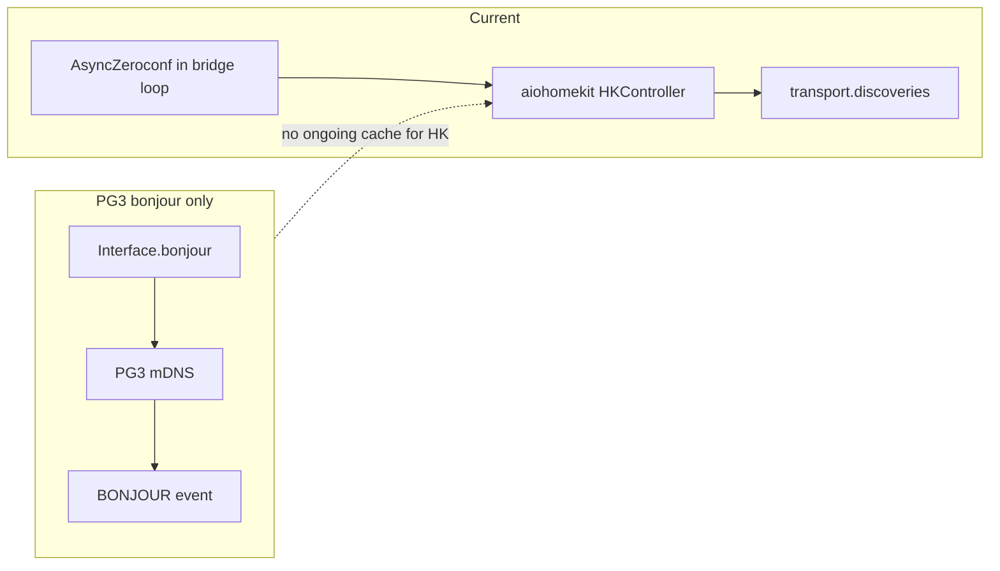

# PG3 `bonjour()` vs plugin zeroconf

## What the PG3 API offers

From [udi_python_interface API.md](https://github.com/UniversalDevicesInc/udi_python_interface/blob/master/API.md):

- **`polyglot.bonjour()`** — “Sends a request to make a bonjour (mDNS) query on the local network.”
- **`polyglot.BONJOUR`** — subscribe to receive responses.

The doc does **not** specify service type (e.g. `_hap._tcp.local.`), query duration, TXT/SRV detail level, or response schema. That must be confirmed in **`udi_interface` source** (e.g. `interface.py`) on the same repo.

## What this plugin uses zeroconf for (cannot be removed casually)

In [`homekit_hub/bridge.py`](c:\Users\jimse\OneDrive\Documents\GitHub\udi-poly-homekit\homekit_hub\bridge.py):

1. **aiohomekit contract** — `HKController(async_zeroconf_instance=AsyncZeroconf)` is required for IP (and related) transports; [`ZeroconfController.async_start`](https://github.com/Jc2k/aiohomekit/blob/main/aiohomekit/zeroconf.py) attaches to **live** `AsyncServiceBrowser` state and **`transport.discoveries`** updated by ongoing mDNS callbacks.
2. **Pairing and runtime** — [`_wait_for_pairing_discovery`](c:\Users\jimse\OneDrive\Documents\GitHub\udi-poly-homekit\homekit_hub\bridge.py) / [`async_find`](https://github.com/Jc2k/aiohomekit/blob/main/aiohomekit/zeroconf.py) assume the same zeroconf cache the controller started with, not a one-off list from another process.
3. **DISCOVER** — [`discover_collect`](c:\Users\jimse\OneDrive\Documents\GitHub\udi-poly-homekit\homekit_hub\bridge.py) polls `transport.discoveries` over a time window; that cache is populated by the in-process browser.

So **removing all zeroconf** means either:

- **Forking / replacing aiohomekit’s IP stack** with something that does not use `AsyncZeroconf` (very large, high risk), or
- **Injecting synthetic discoveries** into aiohomekit internals (unsupported, brittle across versions).

## Can `bonjour()` replace *anything* usefully?

**Maybe, partially:**

- If PG3’s BONJOUR payload includes **per-instance** HAP data (at minimum: resolvable host/port + **TXT** with `id`, `sf`, `c#`, etc., matching what [`HomeKitService.from_service_info`](https://github.com/Jc2k/aiohomekit/blob/main/aiohomekit/zeroconf.py) needs), you could **feed `last_hap_discover` / DISCOVER UI** when in-process mDNS is problematic.
- That still **does not** give aiohomekit ongoing browse + `async_find` unless you **keep** `AsyncZeroconf` for runtime, or reimplement discovery upstream.

**Architecture snag:** [`homekit_hub/bridge.py`](c:\Users\jimse\OneDrive\Documents\GitHub\udi-poly-homekit\homekit_hub\bridge.py) is intentionally **free of `udi_interface`** (asyncio thread). `bonjour()` + `BONJOUR` would force **`Interface` + MQTT-thread callbacks** into that design or move discovery orchestration into [`nodes/Controller.py`](c:\Users\jimse\OneDrive\Documents\GitHub\udi-poly-homekit\nodes\Controller.py) only.

## Recommendation

| Goal | Verdict |
|------|---------|
| Replace **all** zeroconf with only `bonjour()` | **Not feasible** while staying on stock **aiohomekit** without a large custom transport. |
| Optional **hybrid**: PG3 browse for **UI snapshot** only | **Investigate** after reading UDI’s BONJOUR payload; keep zeroconf for **runtime** unless aiohomekit is replaced. |

## If you still want to explore hybrid later

1. Inspect **`udi_interface`** implementation of `bonjour()` and the **BONJOUR** handler (exact arguments, JSON shape, service types).
2. Map one sample response to the row shape built in [`_row_from_discovery`](c:\Users\jimse\OneDrive\Documents\GitHub\udi-poly-homekit\homekit_hub\bridge.py) / [`_present_hap_discover_results`](c:\Users\jimse\OneDrive\Documents\GitHub\udi-poly-homekit\nodes\Controller.py).
3. Add a **fallback path** in Controller: if enabled and in-process `discover_collect` returns empty, call `poly.bonjour()` and merge results into `last_hap_discover` **without** removing `AsyncZeroconf` from bridge startup.

No code changes in this plan step; this is an architecture decision document.
